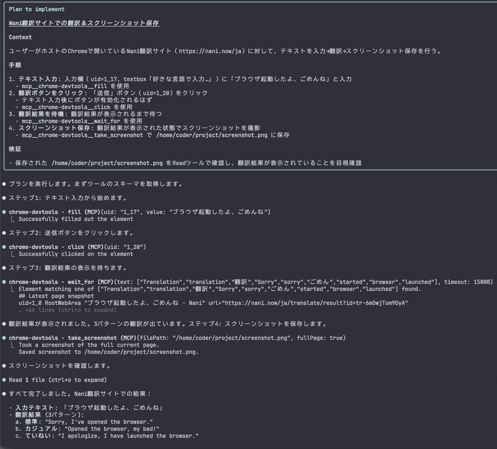
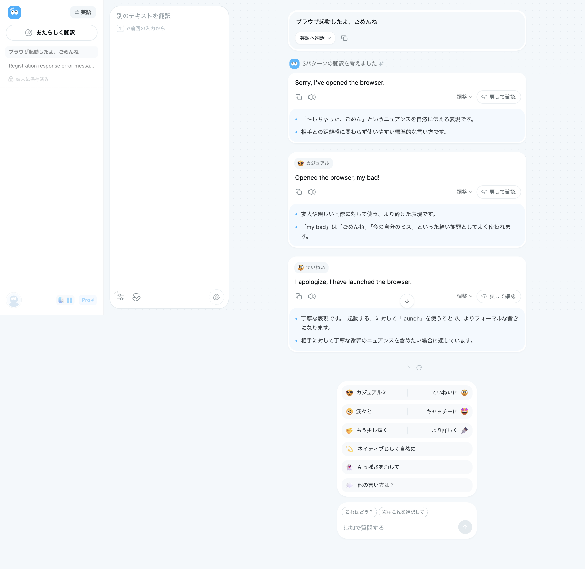

# AI-CON-Gen-Sandbox

A Docker-based development environment for running Claude Code on macOS.
Manage multiple named instances of the same container type with the `./aicon` CLI.

macOS 上の Docker で Claude Code を動かすための開発環境。
名前付きインスタンスで同タイプのコンテナを複数運用でき、`./aicon` CLI で管理する。

**[English](#english) | [日本語](#japanese)**

---

<a id="english"></a>

## English

### Architecture

```
┌──────────────────────────────────────────────────────────────┐
│  Host macOS (Docker Desktop)                                 │
│                                                              │
│  ┌─── acg-sandbox-net ──────────────────────────────────────┐ │
│  │                                                          │ │
│  │  ┌──────────────┐  ┌──────────────┐  ┌──────────────┐  │ │
│  │  │  my-app      │  │  my-api      │  │  experiment  │  │ │
│  │  │  (web-dev)   │  │  (web-dev)   │  │  (sandbox)   │  │ │
│  │  │  Node/Go/Py  │  │  Node/Go/Py  │  │  Node/Python │  │ │
│  │  └──────┬───────┘  └──────┬───────┘  └──────────────┘  │ │
│  │         │                 │                              │ │
│  │         ▼                 ▼                              │ │
│  │       ┌──────────────────────┐                          │ │
│  │       │  acg-postgres         │                          │ │
│  │       │  PostgreSQL 17       │                          │ │
│  │       └──────────────────────┘                          │ │
│  └──────────────────────────────────────────────────────────┘ │
│                                                              │
│  Volumes: All Docker named volumes (no bind mounts)          │
│  User:    Non-root in all containers (coder:1000)            │
│  TZ:      JST (Asia/Tokyo) in all containers                 │
└──────────────────────────────────────────────────────────────┘

Multiple instances of the same type share one image (built once)
```

### Directory Structure

```
ai-con-gen-sandbox/
├── compose.yml                # Base: postgres + shared volumes/networks
├── compose.generated.yml      # Auto-generated: instance service definitions (gitignored)
├── aicon                      # Management CLI script
├── .env.example               # Environment variable template
├── instances/
│   └── registry.json          # Instance management registry (gitignored)
├── containers/
│   ├── web-dev/
│   │   ├── Dockerfile         # Node 22 / Go / Python(uv) / pnpm / Playwright
│   │   └── entrypoint.sh      # Init on startup (auth restore, MCP config, healthcheck)
│   ├── apple-dev/
│   │   ├── Dockerfile         # Swift toolchain
│   │   └── entrypoint.sh      # Init on startup (auth restore, healthcheck)
│   ├── sandbox/
│   │   ├── Dockerfile         # Node / Python(uv) / clasp
│   │   └── entrypoint.sh      # Init on startup (auth restore, MCP config, healthcheck)
│   └── postgres/
│       └── init.sql           # Initial DB & extensions
```

### Container Types

| Type | Purpose | Key Tools |
|------|---------|-----------|
| `web-dev` | Web app development | Node.js 22, Go 1.25, Python 3.13 (uv), pnpm 10, Playwright |
| `apple-dev` | macOS/iOS dev support | Swift 6.1 |
| `sandbox` | GAS, one-off tasks, experiments | Node.js 22, Python 3.13 (uv), clasp |

All types include: Claude Code, gh CLI, ripgrep, jq, JST timezone

### Setup

#### Prerequisites

- macOS + Docker Desktop
- `jq` (`brew install jq`)
- Claude Pro/Max subscription or Anthropic API key

#### 1. Set Environment Variables

```bash
cp .env.example .env
```

Edit `.env` to adjust versions, etc.

`COMPOSE_PROJECT_NAME` in `.env` sets the prefix for all Docker volume and container names (default: `acg-sandbox`).
The `./aicon rm --volumes` and `./aicon purge-shared` commands use this value to identify volumes to delete.

If using a Max subscription, `ANTHROPIC_API_KEY` can be left empty.

#### 2. Create & Start Instances

```bash
# Create a web development instance
./aicon create web-dev my-app

# Add another web development instance (multiple of same type OK)
./aicon create web-dev my-api

# Create a sandbox instance
./aicon create sandbox experiment
```

#### 3. Connect to a Container

```bash
./aicon connect my-app             # Connect to bash
./aicon connect my-app claude      # Launch Claude Code directly
```

#### 4. Claude Code Authentication (First Time Only)

```bash
# Run inside the container
claude login
# → Open the displayed URL in your host Mac's browser to authenticate
# → Token is persisted in shared-claude-config volume (shared across all instances)
```

Check auth status with `./aicon auth-status`.

### ./aicon Command Reference

| Command | Description |
|---------|-------------|
| `./aicon create <type> <name>` | Create & start an instance |
| `./aicon connect <name> [cmd]` | Connect to container (default: bash) |
| `./aicon list` | List all instances (name, type, status) |
| `./aicon rm <name> [--volumes]` | Remove instance (`--volumes` to also remove volumes) |
| `./aicon purge-shared [vol ...]` | Remove shared volumes (auth, DB data) |
| `./aicon start <name>` | Start an instance |
| `./aicon stop <name>` | Stop an instance |
| `./aicon up` | Start all instances |
| `./aicon down` | Stop all containers |
| `./aicon build [type]` | Build images (omit type for all) |
| `./aicon regenerate` | Regenerate compose.generated.yml from templates |
| `./aicon ps` | Show running container status |
| `./aicon auth-status [name]` | Check Claude Code auth status (token expiry) |
| `./aicon types` | List available container types |
| `./aicon help` | Show help |

### Security Design

- **No host exposure**: No bind mounts — all Docker named volumes
- **Non-root execution**: All containers run as `coder` user (UID 1000)
- **Shared network**: Single `acg-sandbox-net`. Prioritizes convenience over isolation for local dev
- **Claude Code write scope**: Limited to `/home/coder/project` by non-root permissions
- **PID 1 management**: `init: true` (tini) for proper signal forwarding

### License

This project is licensed under the [MIT License](LICENSE).

---

<a id="japanese"></a>

## 日本語

### アーキテクチャ

```
┌──────────────────────────────────────────────────────────────┐
│  Host macOS（Docker Desktop）                                 │
│                                                              │
│  ┌─── acg-sandbox-net ──────────────────────────────────────┐ │
│  │                                                          │ │
│  │  ┌──────────────┐  ┌──────────────┐  ┌──────────────┐  │ │
│  │  │  my-app      │  │  my-api      │  │  experiment  │  │ │
│  │  │  (web-dev)   │  │  (web-dev)   │  │  (sandbox)   │  │ │
│  │  │  Node/Go/Py  │  │  Node/Go/Py  │  │  Node/Python │  │ │
│  │  └──────┬───────┘  └──────┬───────┘  └──────────────┘  │ │
│  │         │                 │                              │ │
│  │         ▼                 ▼                              │ │
│  │       ┌──────────────────────┐                          │ │
│  │       │  acg-postgres         │                          │ │
│  │       │  PostgreSQL 17       │                          │ │
│  │       └──────────────────────┘                          │ │
│  └──────────────────────────────────────────────────────────┘ │
│                                                              │
│  ボリューム: すべて Docker named volume（bind mount なし）      │
│  ユーザー:   全コンテナ非 root（coder:1000）                     │
│  TZ:        全コンテナ JST（Asia/Tokyo）                        │
└──────────────────────────────────────────────────────────────┘

同タイプの複数インスタンスは同じイメージを共有（ビルドは1回）
```

### ディレクトリ構成

```
ai-con-gen-sandbox/
├── compose.yml                # ベース: postgres + 共有ボリューム/ネットワーク
├── compose.generated.yml      # 自動生成: インスタンスのサービス定義（gitignore）
├── aicon                      # 管理 CLI スクリプト
├── .env.example               # 環境変数テンプレート
├── instances/
│   └── registry.json          # インスタンス管理レジストリ（gitignore）
├── containers/
│   ├── web-dev/
│   │   ├── Dockerfile         # Node 22 / Go / Python(uv) / pnpm / Playwright
│   │   └── entrypoint.sh      # 起動時初期化（認証復元・MCP設定・ヘルスチェック）
│   ├── apple-dev/
│   │   ├── Dockerfile         # Swift toolchain
│   │   └── entrypoint.sh      # 起動時初期化（認証復元・ヘルスチェック）
│   ├── sandbox/
│   │   ├── Dockerfile         # Node / Python(uv) / clasp
│   │   └── entrypoint.sh      # 起動時初期化（認証復元・MCP設定・ヘルスチェック）
│   └── postgres/
│       └── init.sql           # 初期 DB・拡張機能
```

### コンテナタイプ

| タイプ | 用途 | 主要ツール |
|--------|------|-----------|
| `web-dev` | Web アプリ開発 | Node.js 22, Go 1.25, Python 3.13 (uv), pnpm 10, Playwright |
| `apple-dev` | macOS/iOS 開発補助 | Swift 6.1 |
| `sandbox` | GAS・単発作業・実験 | Node.js 22, Python 3.13 (uv), clasp |

全タイプ共通: Claude Code, gh CLI, ripgrep, jq, JST タイムゾーン

### セットアップ

#### 前提条件

- macOS + Docker Desktop
- `jq`（`brew install jq`）
- Claude Pro/Max サブスクリプション または Anthropic API キー

#### 1. 環境変数の設定

```bash
cp .env.example .env
```

`.env` を編集してバージョン等を調整する。

`.env` の `COMPOSE_PROJECT_NAME` は Docker ボリューム名・コンテナ名のプレフィックスを決定する（デフォルト: `acg-sandbox`）。
`./aicon rm --volumes` や `./aicon purge-shared` もこの値でボリュームを特定して削除する。

Max サブスクリプションで使う場合、`ANTHROPIC_API_KEY` は空のままでよい。

#### 2. インスタンス作成 & 起動

```bash
# Web 開発用インスタンスを作成
./aicon create web-dev my-app

# 別の Web 開発インスタンスを追加（同タイプ複数 OK）
./aicon create web-dev my-api

# Sandbox インスタンスを作成
./aicon create sandbox experiment
```

#### 3. コンテナに接続

```bash
./aicon connect my-app             # bash に接続
./aicon connect my-app claude      # Claude Code を直接起動
```

#### 4. Claude Code の認証（初回のみ）

```bash
# コンテナ内で実行
claude login
# → 表示される URL をホスト Mac のブラウザで開いて認証
# → トークンは shared-claude-config volume に永続化（全インスタンスで共有）
```

認証状態は `./aicon auth-status` で確認できる。

### ./aicon コマンドリファレンス

| コマンド | 説明 |
|---------|------|
| `./aicon create <type> <name>` | インスタンス作成＋起動 |
| `./aicon connect <name> [cmd]` | コンテナに接続（デフォルト: bash） |
| `./aicon list` | 全インスタンス一覧（名前・タイプ・ステータス） |
| `./aicon rm <name> [--volumes]` | インスタンス削除（`--volumes` でボリュームも削除） |
| `./aicon purge-shared [vol ...]` | 共有ボリューム削除（認証情報・DB データ） |
| `./aicon start <name>` | インスタンス起動 |
| `./aicon stop <name>` | インスタンス停止 |
| `./aicon up` | 全インスタンス一括起動 |
| `./aicon down` | 全コンテナ一括停止 |
| `./aicon build [type]` | イメージビルド（タイプ省略で全タイプ） |
| `./aicon regenerate` | compose.generated.yml をテンプレートから再生成 |
| `./aicon ps` | 実行中コンテナの状態 |
| `./aicon auth-status [name]` | Claude Code 認証状態確認（トークン有効期限表示） |
| `./aicon types` | 利用可能なコンテナタイプ一覧 |
| `./aicon help` | ヘルプ表示 |

### Git / GitHub の設定

#### git ユーザー設定（初回のみ）

```bash
# コンテナ内で実行（named volume に永続化される）
git config --global user.name "Your Name"
git config --global user.email "your@email.com"
```

#### GitHub 認証

**方法 A: GITHUB_TOKEN 環境変数（推奨）**

`.env` に `GITHUB_TOKEN` を設定すれば `gh` CLI と `git push` (HTTPS) が自動で認証される。

```
GITHUB_TOKEN=ghp_xxxxxxxxxxxxxxxxxxxx
```

**方法 B: gh auth login（対話式）**

```bash
# コンテナ内で実行
gh auth login
```

認証情報は `shared-gh-config` volume に永続化される。

### バージョン変更

`.env` で各ツールのバージョンを変更し、イメージを再ビルドする。

```bash
# .env を編集
GO_VERSION=1.25.0
PYTHON_VERSION=3.13

# 再ビルド
./aicon build web-dev
```

### 認証情報の永続化

Claude Code の認証情報は以下の仕組みで全インスタンス間で共有・永続化される。

- **shared volume**: `shared-claude-config` が全コンテナの `~/.claude` にマウントされる
- **起動時復元**: `entrypoint.sh` が `~/.claude/.claude.json` → `~/.claude.json` にコピー
- **終了時保存**: `.bashrc` の EXIT trap が `~/.claude.json` → `~/.claude/.claude.json` にコピー
- **machine-id**: ビルド時にランダム UUID を `/etc/machine-id` に設定（空の machine-id による認証保持失敗を防止）

### セキュリティ設計

- **ホスト非公開**: bind mount を一切使わず、すべて Docker named volume
- **非 root 実行**: 全コンテナ `coder` ユーザー（UID 1000）で動作
- **共有ネットワーク**: `acg-sandbox-net` 1本で構成。ローカル開発環境のため分離より利便性を優先
- **Claude Code の書き込み範囲**: 非 root ユーザーの権限により `/home/coder/project` 配下に限定
- **PID 1 管理**: `init: true`（tini）によりシグナル転送を適切に処理

### Chrome DevTools MCP（ホスト Chrome をコンテナから操作）

コンテナ内の Claude Code からホスト macOS 上の Chrome を CDP 経由で操作できる。
対応コンテナタイプ: `web-dev`, `sandbox`

#### 1. ホストで Chrome をリモートデバッグモードで起動

```bash
/Applications/Google\ Chrome.app/Contents/MacOS/Google\ Chrome \
  --remote-debugging-port=9222 \
  --remote-debugging-address=0.0.0.0 \
  "--remote-allow-origins=*" \
  --user-data-dir="$HOME/.chrome-debug-profile"
```

> **注意**:
> - `--remote-debugging-address=0.0.0.0` と `--remote-allow-origins=*` はコンテナからの CDP（WebSocket）接続に必須
> - 初回起動時は空プロファイルになるため、必要に応じて Chrome にログインし直す
> - プロファイルは `~/.chrome-debug-profile` に永続保存されるため、2回目以降はそのまま使える
> - 通常の Chrome と同時起動可能（別プロファイルのため干渉しない）

#### 2. コンテナ内で MCP 設定を適用

コンテナ起動時に `entrypoint.sh` が `host.docker.internal` の IPv4 アドレスを解決し、MCP テンプレートを `~/project/.mcp.json.chrome-devtool` に自動生成する。

利用するにはプロジェクトディレクトリで `.mcp.json` にリネームするだけでよい。

```bash
cp ~/project/.mcp.json.chrome-devtool ~/project/.mcp.json
```

#### 3. 接続確認

```bash
# ホスト側で確認
curl http://localhost:9222/json/version

# コンテナ内から確認（IPv4 アドレス経由）
curl http://$(getent ahostsv4 host.docker.internal | awk 'NR==1{print $1}'):9222/json/version
```

> **注意**: コンテナから `host.docker.internal:9222` にホスト名で直接アクセスすると、Chrome の Host ヘッダー検証で拒否される。
> MCP テンプレートでは起動時に `host.docker.internal` を IPv4 アドレスに解決し、IP 直接接続することでこの問題を回避している。
> Docker Desktop が IPv6 アドレスを返す場合があるため、`getent ahostsv4` で IPv4 のみを取得する。

#### 4. テンプレート更新を既存インスタンスに反映

Dockerfile のテンプレートを変更した場合、既存インスタンスに反映するにはイメージの再ビルドと compose ファイルの再生成が必要。

```bash
./aicon build
./aicon regenerate
./aicon up
```

> **注意**: `~/project/.mcp.json.chrome-devtool` または `~/project/.mcp.json` が既に存在する場合、entrypoint.sh はテンプレートコピーをスキップする。
> テンプレートを再生成するには既存ファイルを削除してからコンテナを再起動する。

#### 使用例: Nani翻訳サイトでの自動操作

コンテナ内の Claude Code からホスト Chrome 上の翻訳サイトを操作した例:

**Claude Code の実行ログ（MCP ツール呼び出し）:**



**操作結果（ホスト Chrome 上の翻訳サイト）:**



### 旧構成からのマイグレーション

旧 `compose.yml`（固定コンテナ定義）から移行する場合:

1. 旧コンテナのデータをバックアップ（必要に応じて）
2. 旧コンテナを停止: `docker compose down`
3. 新しい `./aicon` で同等のインスタンスを作成:
   ```bash
   ./aicon create web-dev web-dev
   ./aicon create apple-dev apple-dev
   ./aicon create sandbox sandbox
   ```
4. 旧ボリューム（`web-dev-project` 等）からデータ移行が必要な場合は `docker volume` コマンドで対応

### よく使うワークフロー

```bash
# インスタンス一覧
./aicon list

# 認証状態を確認
./aicon auth-status

# 接続してプロジェクトを clone
./aicon connect my-app
cd /home/coder/project
gh repo clone your-org/your-repo
cd your-repo
claude

# 全停止
./aicon down

# インスタンスとボリュームを完全削除
./aicon rm experiment --volumes

# 共有ボリュームを削除（認証情報・DB データ）
./aicon purge-shared
```

### ライセンス

このプロジェクトは [MIT License](LICENSE) の下で公開されています。
